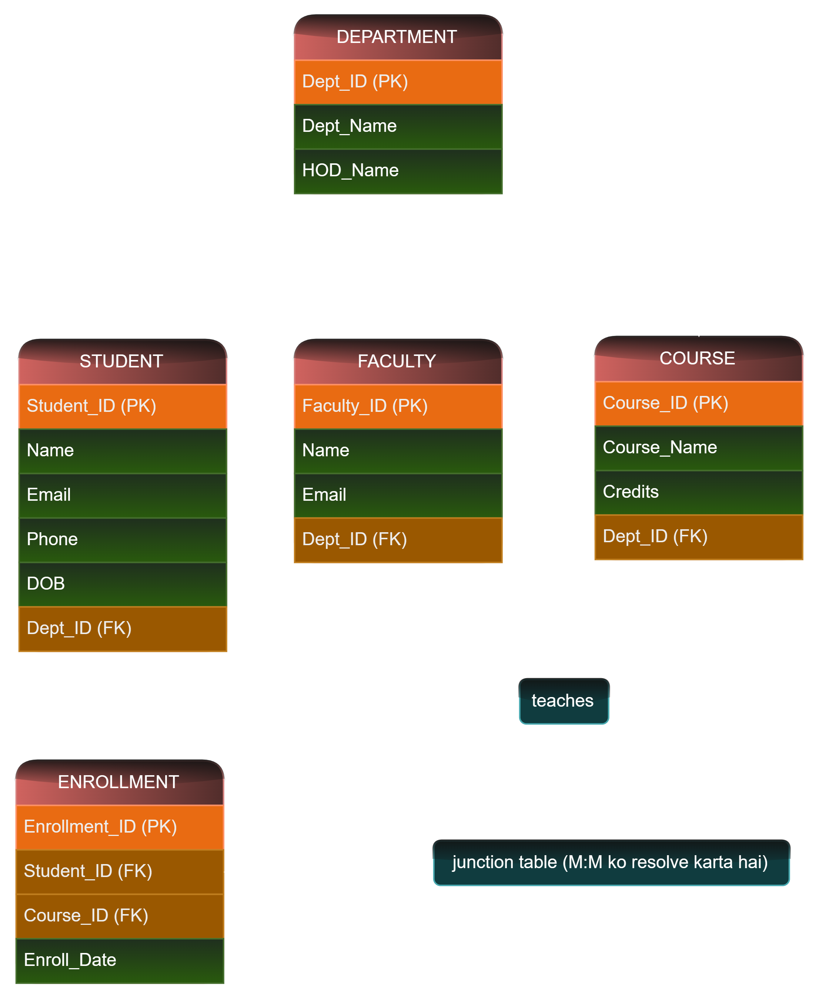

# Experiment 2 — ER Diagram Design for College Database

**Course:** DBMS Lab (BCS551 / KCS551)
**CO Mapping:** CO2
**Bloom's Level:** K2, K3

## Aim
To identify entities, attributes, keys and relationships for a College
Management System, and design an ER diagram.

## Theory — Key Terms

| Term | Meaning |
|---|---|
| Entity | Real-world object we store data about (Student, Course) |
| Attribute | Property of an entity (Name, Age) |
| Primary Key (PK) | Uniquely identifies each row, cannot be NULL |
| Foreign Key (FK) | References the Primary Key of another table |
| Composite Key | Two or more attributes together forming a key |
| Cardinality | Number of instances that can participate in a relationship (1:1, 1:M, M:M) |
| Strong Entity | Has its own Primary Key |
| Weak Entity | Depends on a strong entity for identification |

## Entities and Attributes

**DEPARTMENT**
- Dept_ID (PK)
- Dept_Name
- HOD_Name

**STUDENT**
- Student_ID (PK)
- Name
- Email
- Phone
- DOB
- Dept_ID (FK → DEPARTMENT)

**FACULTY**
- Faculty_ID (PK)
- Name
- Email
- Dept_ID (FK → DEPARTMENT)

**COURSE**
- Course_ID (PK)
- Course_Name
- Credits
- Dept_ID (FK → DEPARTMENT)

**ENROLLMENT** (junction table)
- Enrollment_ID (PK)
- Student_ID (FK → STUDENT)
- Course_ID (FK → COURSE)
- Enroll_Date

## Relationships and Cardinality

| Relationship | Type | Description |
|---|---|---|
| DEPARTMENT – STUDENT | 1 : M | One department has many students |
| DEPARTMENT – FACULTY | 1 : M | One department has many faculty members |
| DEPARTMENT – COURSE | 1 : M | One department offers many courses |
| FACULTY – COURSE (teaches) | 1 : M | One faculty can teach many courses |
| STUDENT – COURSE | M : M | Resolved via ENROLLMENT junction table |

## Why a Junction Table?

A direct Many-to-Many relationship cannot be implemented in a relational
database. It is resolved by creating an associative (junction) table —
here, `ENROLLMENT` — which holds the Primary Keys of both related tables
as Foreign Keys.

## ER Diagram

## Result
Entities, attributes, primary/foreign keys and relationships (1:M and M:M)
for the College Database were identified, and the ER diagram was designed
with a junction table to resolve the Student–Course many-to-many relationship.

## Viva Questions

| Question | Answer |
|---|---|
| What is a weak entity? | An entity with no PK of its own; depends on a strong entity |
| How is M:M represented in a relational database? | Using a junction/bridge table with both PKs as FKs |
| Difference between candidate key and primary key? | Candidate key = all eligible unique attributes; primary key = the one chosen |
| What is a composite key? | Two or more columns together forming a primary key |

## Common Errors / Confusion Points

| Confusion | Clarification |
|---|---|
| Attribute vs Entity | Attribute is a property of an entity, not an entity itself |
| FK mistaken for PK | FK refers to another table's PK, not a unique identifier in its own table |
| Directly implementing M:M | Not possible — always requires a junction table |